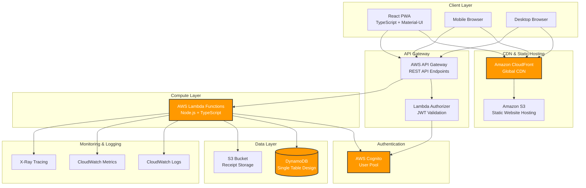
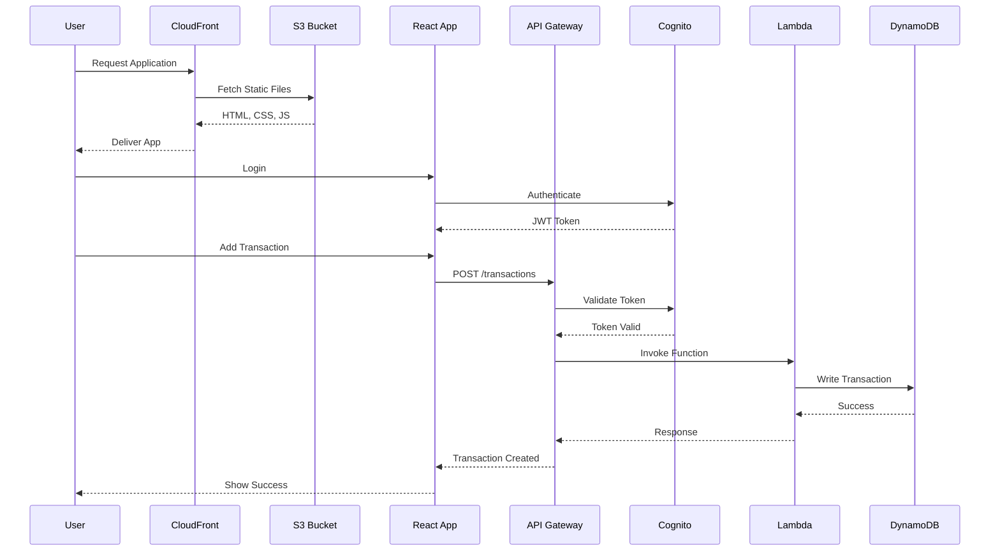
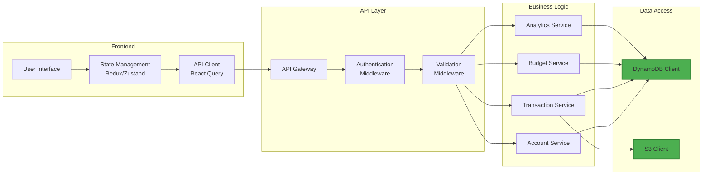
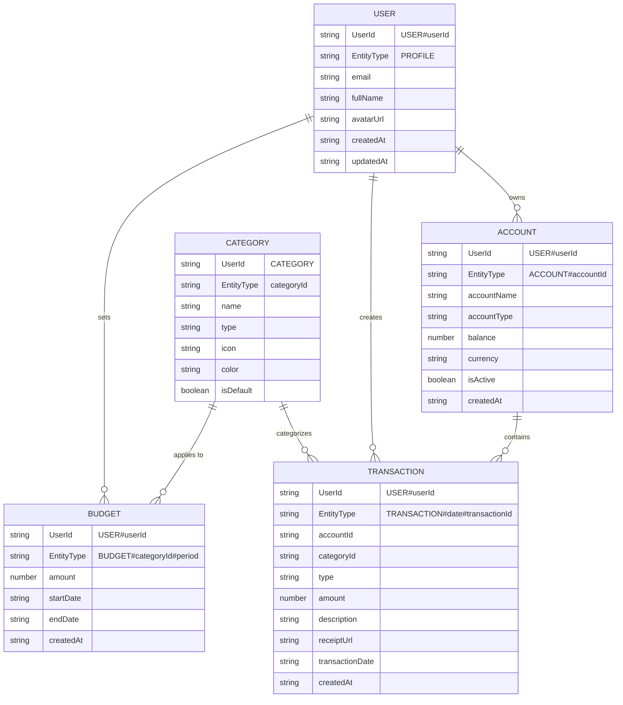

# 💰 TrackMyExpense

A modern, professional expense tracking application built with React, TypeScript, and AWS serverless architecture. Track multiple bank accounts, manage expenses and income, visualize spending patterns, and maintain complete control over your finances.


---

## 🎯 Overview

TrackMyExpense is a cross-platform Progressive Web App (PWA) that works seamlessly on mobile phones, tablets, and laptops. Built with a serverless-first approach, it offers unlimited scalability while maintaining minimal costs.

### Key Highlights

- 📱 **Responsive Design** - Works perfectly on all devices
- 🎨 **Premium UI** - Modern glassmorphism design with smooth animations
- 🚀 **Serverless Architecture** - Scales from 100 to 1M+ users automatically
- 💵 **Cost-Effective** - ~$15-25/month for initial deployment
- 🔒 **Secure** - AWS Cognito authentication with JWT tokens
- ⚡ **Fast** - Global CDN delivery with sub-second load times
- 🌙 **Dark Mode** - Beautiful dark theme with light mode toggle

---

## ✨ Features

### MVP Features (Release 1.0)

#### 🏦 Multi-Account Management
- Add unlimited bank accounts (Checking, Savings, Credit Card, Cash, Investment)
- Set and adjust account balances
- View real-time account summaries
- Archive or delete accounts
- Track total net worth across all accounts

#### 💸 Transaction Management
- Add expenses and income entries
- Categorize transactions with predefined and custom categories
- Add detailed notes and descriptions
- Edit and delete transactions
- Attach receipt images to transactions
- Filter transactions by date, category, and account
- Search transactions by description

#### 👤 User Authentication
- Secure email/password registration
- Login with session management
- Password recovery and reset
- Email verification
- Secure logout

#### 📊 Basic Dashboard
- Account balance overview
- Recent transactions list
- Quick add transaction
- Monthly spending summary

### Enhanced Features (Future Releases)

#### 📈 Analytics & Visualization (Release 2.0)
- Interactive charts and graphs (pie, line, bar)
- Monthly and yearly spending trends
- Category-wise breakdown analysis
- Income vs Expense comparison
- Budget vs Actual spending visualization
- Custom date range reports
- Spending heatmaps

#### 💰 Budget Management (Release 2.1)
- Set monthly budgets per category
- Real-time budget tracking
- Overspending alerts and notifications
- Budget recommendations based on spending patterns
- Rollover unused budget to next month

#### 🔄 Recurring Transactions (Release 2.2)
- Set up recurring expenses (rent, subscriptions, bills)
- Automatic transaction creation
- Recurring income tracking (salary, dividends)
- Edit or skip recurring entries

#### 🌍 Multi-Currency Support (Release 2.3)
- Support for 150+ currencies
- Real-time currency conversion
- Multi-currency accounts
- Exchange rate tracking

#### 📤 Data Export & Reports (Release 2.4)
- Export transactions to CSV
- Generate PDF reports
- Monthly/yearly financial statements
- Tax preparation reports
- Custom report builder

#### 🔔 Smart Notifications (Release 2.5)
- Budget limit warnings
- Unusual spending alerts
- Bill payment reminders
- Weekly/monthly spending summaries
- Low balance notifications

#### 🤝 Shared Accounts (Release 3.0)
- Family account sharing
- Split expenses with others
- Collaborative budgets
- Activity logs for shared accounts

---

## 🏗️ Architecture

### System Architecture Diagram



### Application Flow Diagram



### Data Flow Architecture



---

## 🗄️ Database Schema

### DynamoDB Single Table Design



### Access Patterns

| Pattern | UserId | EntityType | GSI |
|---------|----|----|-----|
| Get user profile | USER#userId | PROFILE | - |
| Get all accounts | USER#userId | begins_with(ACCOUNT#) | - |
| Get single account | USER#userId | ACCOUNT#accountId | - |
| Get transactions by date | USER#userId | begins_with(TRANSACTION#2024-01) | - |
| Get transaction by ID | USER#userId | TRANSACTION#date#transactionId | - |
| Get budgets | USER#userId | begins_with(BUDGET#) | - |
| Get all categories | CATEGORY | - | - |

---

## 🛠️ Technology Stack

### Frontend
- **Framework:** React 18.x
- **Language:** TypeScript 5.x
- **Build Tool:** Vite
- **UI Library:** Material-UI (MUI) v5
- **State Management:** Zustand or Redux Toolkit
- **Data Fetching:** React Query (TanStack Query)
- **Charts:** Recharts
- **Forms:** React Hook Form + Zod validation
- **Routing:** React Router v6
- **Styling:** Styled-components or Emotion (CSS-in-JS)
- **Animations:** Framer Motion
- **Date Handling:** date-fns
- **HTTP Client:** Axios

### Backend
- **Runtime:** Node.js 20.x
- **Language:** TypeScript 5.x
- **Framework:** Express.js or Fastify
- **Validation:** Zod
- **Authentication:** AWS Cognito + JWT
- **File Upload:** Multer + AWS SDK
- **Logging:** Winston or Pino
- **Testing:** Jest + Supertest

### AWS Infrastructure
- **Hosting:** S3 + CloudFront
- **Compute:** AWS Lambda
- **API:** API Gateway (REST)
- **Database:** DynamoDB
- **Storage:** S3 (receipts)
- **Authentication:** Cognito User Pools
- **Monitoring:** CloudWatch + X-Ray
- **DNS:** Route53
- **SSL:** AWS Certificate Manager (ACM)

### DevOps & CI/CD
- **Version Control:** Git + GitHub
- **CI/CD:** GitHub Actions
- **Infrastructure as Code:** AWS CDK or Terraform
- **Package Manager:** npm or pnpm
- **Code Quality:** ESLint + Prettier
- **Pre-commit Hooks:** Husky + lint-staged

---

## 📁 Project Structure

```
TrackMyExpense/
├── frontend/                    # React application
│   ├── public/
│   │   ├── icons/              # PWA icons
│   │   ├── manifest.json       # PWA manifest
│   │   └── index.html
│   ├── src/
│   │   ├── assets/             # Images, fonts
│   │   ├── components/         # Reusable components
│   │   │   ├── common/         # Buttons, inputs, cards
│   │   │   ├── layout/         # Header, sidebar, footer
│   │   │   └── features/       # Feature-specific components
│   │   ├── pages/              # Page components
│   │   │   ├── Auth/           # Login, signup, forgot password
│   │   │   ├── Dashboard/      # Main dashboard
│   │   │   ├── Accounts/       # Account management
│   │   │   ├── Transactions/   # Transaction list, add/edit
│   │   │   └── Settings/       # User settings
│   │   ├── hooks/              # Custom React hooks
│   │   ├── services/           # API service layer
│   │   ├── store/              # State management
│   │   ├── types/              # TypeScript types
│   │   ├── utils/              # Helper functions
│   │   ├── theme/              # MUI theme configuration
│   │   ├── App.tsx             # Root component
│   │   └── main.tsx            # Entry point
│   ├── package.json
│   ├── tsconfig.json
│   ├── vite.config.ts
│   └── .env.example
│
├── backend/                     # Lambda functions
│   ├── src/
│   │   ├── functions/          # Lambda handlers
│   │   │   ├── auth/           # Authentication functions
│   │   │   ├── accounts/       # Account CRUD
│   │   │   ├── transactions/   # Transaction CRUD
│   │   │   ├── budgets/        # Budget management
│   │   │   └── analytics/      # Analytics & reports
│   │   ├── services/           # Business logic
│   │   ├── repositories/       # Data access layer
│   │   ├── models/             # Data models
│   │   ├── middleware/         # Auth, validation, error handling
│   │   ├── utils/              # Helper functions
│   │   └── types/              # TypeScript types
│   ├── package.json
│   ├── tsconfig.json
│   └── .env.example
│
├── infrastructure/              # AWS infrastructure
│   ├── cdk/                    # AWS CDK (or Terraform)
│   │   ├── lib/
│   │   │   ├── frontend-stack.ts
│   │   │   ├── backend-stack.ts
│   │   │   ├── database-stack.ts
│   │   │   └── auth-stack.ts
│   │   └── bin/
│   │       └── app.ts
│   └── scripts/                # Deployment scripts
│
├── .github/
│   └── workflows/              # GitHub Actions
│       ├── frontend-deploy.yml
│       └── backend-deploy.yml
│
├── docs/                       # Documentation
│   ├── API.md                  # API documentation
│   ├── DEPLOYMENT.md           # Deployment guide
│   └── CONTRIBUTING.md         # Contribution guidelines
│
├── .gitignore
├── README.md
└── LICENSE
```

---

## 🚀 Getting Started

### Prerequisites

- Node.js >= 20.0.0
- npm or pnpm
- AWS Account
- AWS CLI configured
- Git

### Installation

1. **Clone the repository**
```bash
git clone https://github.com/yourusername/TrackMyExpense.git
cd TrackMyExpense
```

2. **Install frontend dependencies**
```bash
cd frontend
npm install
```

3. **Install backend dependencies**
```bash
cd ../backend
npm install
```

4. **Set up environment variables**
```bash
# Frontend
cp frontend/.env.example frontend/.env.local
# Edit .env.local with your AWS Cognito details

# Backend
cp backend/.env.example backend/.env
# Edit .env with your AWS credentials
```

5. **Run frontend locally**
```bash
cd frontend
npm run dev
```

6. **Run backend locally (with SAM or Serverless Framework)**
```bash
cd backend
npm run dev
```

---

## 🌐 Deployment

### Frontend Deployment (S3 + CloudFront)

```bash
# Build the frontend
cd frontend
npm run build

# Deploy to S3 (using AWS CLI)
aws s3 sync dist/ s3://your-bucket-name --delete

# Invalidate CloudFront cache
aws cloudfront create-invalidation --distribution-id YOUR_DIST_ID --paths "/*"
```

### Backend Deployment (Lambda)

```bash
# Using AWS CDK
cd infrastructure/cdk
npm run deploy

# Or using Serverless Framework
cd backend
serverless deploy
```

### Automated Deployment (GitHub Actions)

Push to `main` branch triggers automatic deployment:
- Frontend → S3 + CloudFront
- Backend → Lambda functions
- Database migrations → DynamoDB

---

## 💰 Cost Estimation

### Monthly Costs (100 Active Users)

| Service | Usage | Cost |
|---------|-------|------|
| S3 (Static Hosting) | 1GB storage, 10K requests | $0.50 |
| CloudFront | 10GB data transfer | $1.50 |
| API Gateway | 100K requests | $3.50 |
| Lambda | 100K invocations, 512MB | $4.00 |
| DynamoDB | 1M reads, 500K writes | $3.00 |
| Cognito | 100 MAU | Free |
| S3 (Receipts) | 5GB storage | $1.00 |
| CloudWatch | Logs & metrics | $2.00 |
| Route53 | 1 hosted zone | $0.50 |
| **Total** | | **~$16/month** |

### Scaling Costs

- **1,000 users:** ~$50-75/month
- **10,000 users:** ~$150-250/month
- **100,000 users:** ~$500-800/month

---

## 🔒 Security

### Authentication & Authorization
- AWS Cognito User Pools for user management
- JWT tokens with refresh mechanism
- Password hashing with bcrypt
- Email verification required
- MFA support (future release)

### Data Security
- All data encrypted at rest (DynamoDB encryption)
- All data encrypted in transit (HTTPS/TLS)
- Signed URLs for receipt uploads
- CORS properly configured
- API rate limiting

### Best Practices
- Input validation on client and server
- SQL injection prevention (N/A - NoSQL)
- XSS protection with Content Security Policy
- CSRF protection
- Regular security audits

---

## 📊 Performance

### Targets
- **Page Load:** < 2 seconds (First Contentful Paint)
- **API Response:** < 500ms (p95)
- **Uptime:** 99.9%
- **Mobile Performance Score:** > 90 (Lighthouse)

### Optimizations
- Code splitting and lazy loading
- Image optimization and lazy loading
- CloudFront CDN for global delivery
- DynamoDB single-digit millisecond latency
- Lambda cold start optimization
- React Query caching

---

## 🧪 Testing

### Frontend Testing
```bash
cd frontend
npm run test          # Unit tests (Vitest)
npm run test:e2e      # E2E tests (Playwright)
npm run lint          # ESLint
npm run type-check    # TypeScript
```

### Backend Testing
```bash
cd backend
npm run test          # Unit tests (Jest)
npm run test:integration  # Integration tests
npm run lint          # ESLint
```

---

## 📱 Progressive Web App (PWA)

### Features
- ✅ Installable on mobile and desktop
- ✅ Offline support with service workers
- ✅ Push notifications (future)
- ✅ Background sync
- ✅ Add to home screen prompt
- ✅ App-like experience

---

## 🎨 Design System

### Color Palette
- **Primary:** Indigo (#6366f1)
- **Secondary:** Purple (#8b5cf6)
- **Success:** Emerald (#10b981)
- **Warning:** Amber (#f59e0b)
- **Error:** Red (#ef4444)
- **Background (Dark):** #0f172a
- **Surface (Dark):** #1e293b

### Typography
- **Font Family:** Inter (Google Fonts)
- **Headings:** 600-700 weight
- **Body:** 400-500 weight

### Components
- Glassmorphism cards
- Smooth transitions (200-300ms)
- Hover effects
- Loading skeletons
- Toast notifications

---

## 🗺️ Roadmap

### Q1 2026 - MVP (v1.0)
- [x] Project setup and architecture
- [ ] User authentication
- [ ] Account management
- [ ] Transaction CRUD
- [ ] Basic dashboard
- [ ] Responsive design
- [ ] PWA implementation
- [ ] AWS deployment

### Q2 2026 - Analytics (v2.0)
- [ ] Charts and visualizations
- [ ] Monthly/yearly reports
- [ ] Category analysis
- [ ] Export to CSV/PDF

### Q3 2026 - Advanced Features (v2.1-2.5)
- [ ] Budget management
- [ ] Recurring transactions
- [ ] Multi-currency support
- [ ] Smart notifications
- [ ] Receipt OCR

### Q4 2026 - Collaboration (v3.0)
- [ ] Shared accounts
- [ ] Split expenses
- [ ] Mobile apps (iOS/Android)

---

## 🤝 Contributing

Contributions are welcome! Please read [CONTRIBUTING.md](docs/CONTRIBUTING.md) for details.

1. Fork the repository
2. Create your feature branch (`git checkout -b feature/AmazingFeature`)
3. Commit your changes (`git commit -m 'Add some AmazingFeature'`)
4. Push to the branch (`git push origin feature/AmazingFeature`)
5. Open a Pull Request

---

## 📄 License

This project is licensed under the MIT License - see the [LICENSE](LICENSE) file for details.

---

## 👥 Authors

- **Your Name** - *Initial work* - [YourGitHub](https://github.com/yourusername)

---

## 🙏 Acknowledgments

- Material-UI for the component library
- AWS for serverless infrastructure
- React community for amazing tools and libraries

---

## 📞 Support

For support, email support@trackmyexpense.com or open an issue on GitHub.

---

## 🔗 Links

- **Live Demo:** https://app.trackmyexpense.com (coming soon)
- **Documentation:** https://docs.trackmyexpense.com (coming soon)
- **API Docs:** https://api.trackmyexpense.com/docs (coming soon)

---

<div align="center">
  <strong>Built with ❤️ using React, TypeScript, and AWS</strong>
</div>
